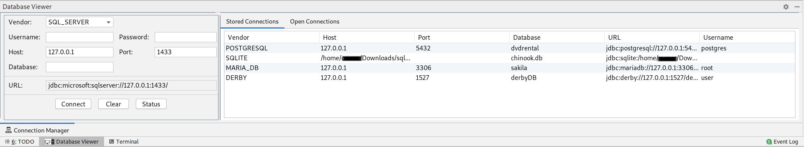
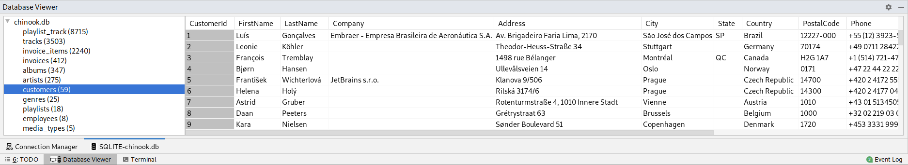

# dbviewer
####Intellij Plugin to view the following databases;

 (Tested)
- MySQL/MariaDB
- Postgresql
- Derby
- H2
- SQLite

(Untested/In-Development)
- MS SQL Server
- Oracle DB
- MS Access
- Excel (Not really a database but still)
- HSQL DB

--------------------------------------------------------------

